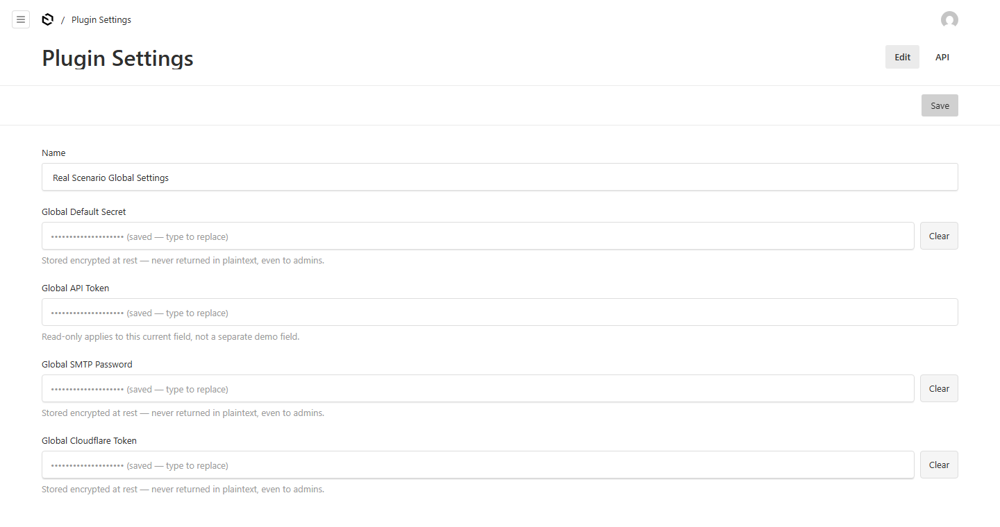

# Payload Plugin - Encrypted Fields

[](https://www.npmjs.com/package/payload-plugin-encrypted-fields)
[](https://www.npmjs.com/package/payload-plugin-encrypted-fields)
[](https://github.com/ssanaullahrais/payload-plugin-encrypted-fields)

Store API keys, SMTP passwords, tokens, and other secrets in Payload CMS without exposing the real value in admin screens or normal API responses.



## What You Get

- Values are encrypted before they are saved.
- Admin users never see the real saved value again.
- REST, GraphQL, Local API, and the admin API view return a safe placeholder.
- The default placeholder is dots: `••••••••••••••••••••`.
- You can show friendly API text like `Cloudflare API Token available`.
- You can hide a field completely with `hidden: true`.
- Your server can still read the real value with `getEncryptedValue()`.
- Works with Payload SQLite and Postgres adapters.

## Try The Demo

This repo includes a Payload + SQLite demo app in `examples/payload-sqlite`. It is for GitHub/testing only and is not included in the npm package.

```sh
npm install
npm run demo
```

Demo login:

```txt
admin@admin.com
password
```

The demo seeds clear test values like `cloudflare-token-123456`, `smtp-password-123456`, and `hidden-secret-123456`.

## Quick Start

Install:

```sh
npm install payload-plugin-encrypted-fields
```

Add the plugin to `payload.config.ts`.

```ts
import { encryptedFieldsPlugin } from "payload-plugin-encrypted-fields"

export default buildConfig({
  plugins: [
    encryptedFieldsPlugin({
      globals: {
        settings: {
          insertAfter: "name",
          fields: [
            {
              name: "cloudflareApiToken",
              label: "Cloudflare API Token",
              apiPlaceholder: "Cloudflare API Token available",
            },
          ],
        },
      },
    }),
  ],
})
```

After saving a value:

```json
{
  "cloudflareApiToken": "Cloudflare API Token available"
}
```

The real token is encrypted in the database and is not returned by normal reads.

## Release

This repo publishes to npm from GitHub Actions when you push a version tag:

```sh
npm version patch
git push origin main --follow-tags
```

GitHub needs one repository secret named `NPM_TOKEN` with npm publish access.

## Add One Field Directly

Use `encryptedField()` when you want to place the field yourself.

```ts
import { encryptedField } from "payload-plugin-encrypted-fields"

export const Settings: GlobalConfig = {
  fields: [
    encryptedField("smtpPassword", {
      label: "SMTP Password",
      apiPlaceholder: "SMTP Password available",
    }),
  ],
}
```

## Read The Real Value

Only do this in trusted server code.

```ts
import { getEncryptedValue } from "payload-plugin-encrypted-fields"

const token = await getEncryptedValue(req.payload, {
  table: "settings",
  column: "cloudflare_api_token",
})
```

Never return this value to the browser.

## Common Recipes

### Default Secret

Returns dots in normal API responses.

```ts
{
  name: "defaultSecret",
  label: "Default Secret",
}
```

### Friendly API Placeholder

Shows that a value exists without exposing it.

```ts
{
  name: "cloudflareApiToken",
  label: "Cloudflare API Token",
  apiPlaceholder: "Cloudflare API Token available",
}
```

### Read-Only Admin Field

Keeps the saved value visible as a placeholder, but prevents admin editing.

```ts
{
  name: "cloudflareApiToken",
  label: "Cloudflare API Token",
  apiPlaceholder: "Cloudflare API Token available",
  admin: {
    readOnly: true,
  },
}
```

You can also use `admin.disabled: true`.

### Hidden Secret

Use this when normal APIs should not receive the field at all.

```ts
{
  name: "internalApiToken",
  label: "Internal API Token",
  hidden: true,
}
```

### Hidden Secret With Endpoint

Use this only when a trusted tool must read the real value over HTTP.

```ts
{
  name: "internalApiToken",
  label: "Internal API Token",
  hidden: true,
  endpoint: {
    access: ({ user }) => Boolean(user),
  },
}
```

Collection endpoint:

```txt
GET /api/{collectionSlug}/{id}/encrypted/{fieldName}
```

Global endpoint:

```txt
GET /api/globals/{globalSlug}/encrypted/{fieldName}
```

## Existing Plain Text Fields

You can replace an existing text field with an encrypted field.

- Old plaintext is masked immediately in normal reads.
- Server code can still read the old value during the transition.
- The next read or save encrypts old plaintext in place.

Before:

```ts
{
  name: "cloudflareApiToken",
  type: "text",
}
```

After:

```ts
encryptedField("cloudflareApiToken", {
  label: "Cloudflare API Token",
  apiPlaceholder: "Cloudflare API Token available",
})
```

If the database column name is different, pass `column`.

## Options

| Option | Default | Purpose |
|---|---|---|
| `label` | none | Field label |
| `apiPlaceholder` | `••••••••••••••••••••` | Value shown in normal reads |
| `mask` | same as `apiPlaceholder` | Older alias |
| `hidden` | `false` | Hide field from admin and normal reads |
| `endpoint` | none | Add a protected plaintext endpoint |
| `access.read` | logged-in users, or false when hidden | Controls who can see the placeholder |
| `admin.readOnly` | `false` | Disable admin editing |
| `admin.disabled` | `false` | Disable admin editing |
| `admin.description` | default text | Admin helper text |
| `admin.condition` | none | Payload admin condition |
| `admin.width` | none | Payload admin width |
| `column` | snake_case field name | Database column name |
| `getSecret` | `process.env.PAYLOAD_SECRET` | Encryption key source |

## Package Notes

- The npm package only ships `dist`, `README.md`, and `package.json`.
- The demo app stays in GitHub under `examples/payload-sqlite`.
- Custom endpoints return plaintext, so always keep endpoint access rules strict.
